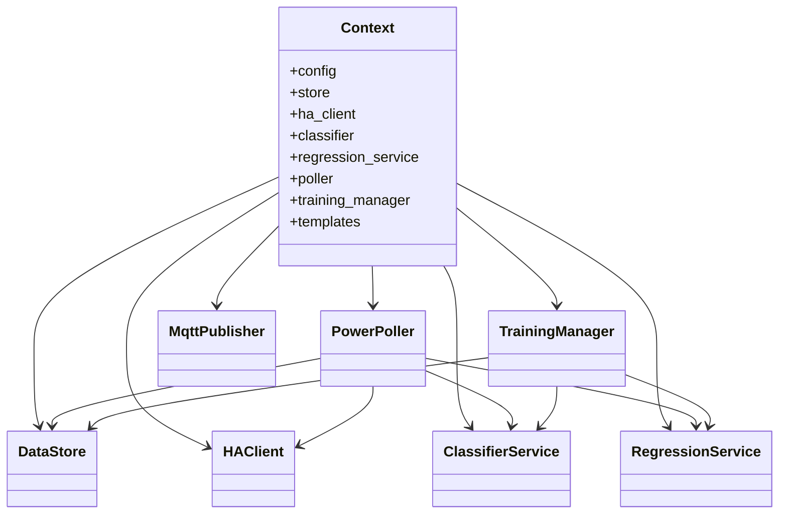

# HA Power Classifier – Technical Docs

## Architecture Overview
- FastAPI app with modular routers (`dashboard`, `segments`, `appliances`, `models`, `logs`, `api`).
- Core services instantiated in `app/context.py`: config, datastore, HA client, classifier, regression, poller, training manager, templates.
- Data persisted in SQLite (current) with models saved via joblib; MQTT or HA REST used for publishing appliance power.
- Segmentation and training operate on power **diffs**; labels are appliance-only (no phases).
- Power deltas: positive flank adds `max(diff)-min(diff)` to appliance current power; negative flank subtracts (clamped ≥0).

## Modules and Key Functions

### app/context.py
- Loads config, creates data dir and service singletons (DataStore, HAClient, ClassifierService, RegressionService, MqttPublisher, TrainingManager, PowerPoller).
- Sets up Jinja templates and `format_ts` filter.

### app/main.py
- `create_app()`: Builds FastAPI app, mounts static files, registers routers, and startup/shutdown hooks.
- Startup: ensure base appliance, clear phase data, HA check, MQTT connect/discovery, start scheduler and poller.
- Shutdown: stop poller/scheduler, close MQTT.

### Routers (app/routers/)
- **dashboard.py**: `dashboard()` renders homepage with diffs, per-sensor data, detection/activity events, training state.
- **segments.py**: CRUD for segments; export/import; batch next-unlabeled; label/accept/reject/delete. Labeling triggers training and power update via flank delta.
- **appliances.py**: List/create/update/rename/delete appliances; supports learning appliances (auto-label from sensor).
- **models_page.py**: Shows training metrics/history and retrain action.
- **logs_page.py**: Logs page and JSON feed.
- **api.py**: JSON endpoints for retrain, metrics, segments, appliances.

### app/poller.py (PowerPoller)
- Polls HA sensors, stores samples/sensor_samples, computes diffs.
- Adaptive thresholding (relative/absolute) to detect significant changes.
- Builds segments with features/flank; applies activity/learning hints; runs classifier for appliance prediction.
- On auto-label (learning) or prediction acceptance, applies power delta (`max(diff)-min(diff)`) with flank sign to current power via `push_power_value`.
- Cleans stale unlabeled segments on schedule.

### app/training.py (TrainingManager)
- Tracks training state/metrics history; scheduler for periodic retrain.
- Eligibility: appliances meeting min label count; uses labeled segments (appliance-only).
- `train`: classifier on segment features; regression on per-sensor diffs; computes power stats using flank-aware deltas.
- Persists metrics history to JSON.

### app/classifier.py
- RandomForest classifier predicting appliance occurrence (no phase).
- Optional hyperparameter tuning over small grid.
- `predict`: returns appliance string; `top_predictions`: sorted list of appliances with probabilities.
- RegressionService: decision-tree regressor per appliance on per-sensor diffs vs time; metrics (MSE/MAPE).

### app/data_store.py (SQLite)
- Manages tables: samples, sensor_samples, segments, appliances.
- CRUD for samples/segments/appliances; label/prediction updates; delete stale segments; import/export segments.
- Tracks current_power, learning flags, activity sensors.
- `clear_phase_data` wipes old phase fields on startup.

### app/utils.py
- `compute_features` on segment samples; `samples_to_diffs`.
- `compute_segment_delta`: `max(diff)-min(diff)` clamped ≥0.
- `push_power_value`: publish/update appliance power via MQTT or HA REST.
- MQTT topic helpers, slugify, etc.

### app/ha_client.py
- Thin REST client for HA `get_state` and `set_state`; masks token in logs.

### app/mqtt_client.py
- Simple MQTT publisher with connect/publish_json/publish_value.

### app/logging_utils.py
- `log_event` with in-memory `recent_logs` deque.

## Frontend
- Templates under `app/templates` (Tailwind UI): dashboard, segments, segment detail (appliance-only labels), appliances, models, logs.
- `app/static/app.js`: draws charts (diffs + events/activity), metric sparklines, auto-refresh dashboard/logs.

## Behavior Highlights
- Segmentation uses diffs; adaptive thresholds available.
- Labels are appliance-only; classifier predicts appliance occurrence.
- Power delta per segment = max-min of diff; positive flank adds, negative subtracts from appliance current power.
- Learning appliances auto-label segments based on their own power sensor changes.
- Exports/imports labeled segments; automation API for retrain/metrics/entities.
